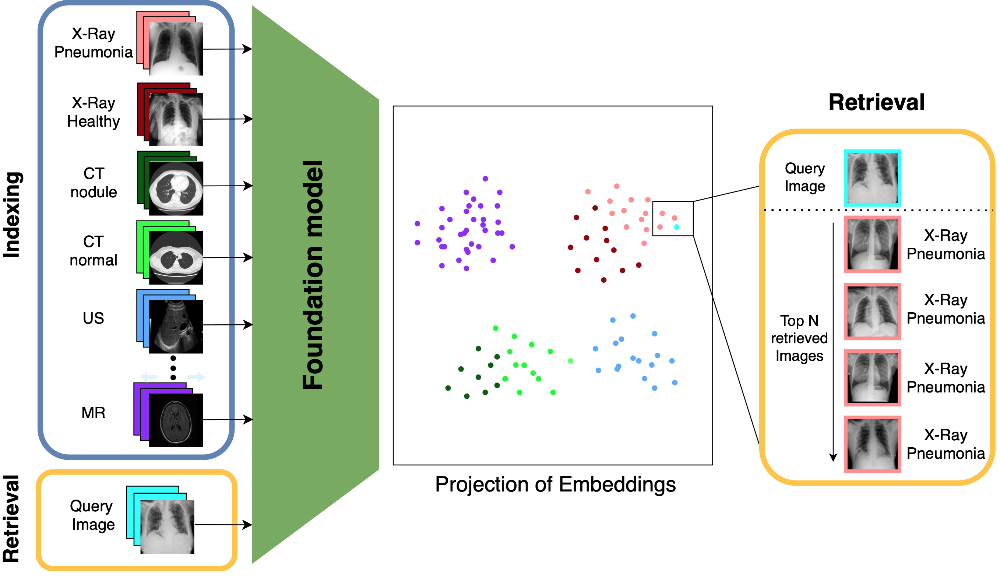

# Leveraging Foundation Models for Content-Based Medical Image Retrieval in Radiology

## Overview


### Abstract

Content-based image retrieval (CBIR) has the potential to significantly improve diagnostic aid and medical research in radiology. Current CBIR systems face limitations due to their specialization to certain pathologies, limiting their utility. In response, we propose using vision foundation models as powerful and versatile off-the-shelf feature extractors for content-based medical image retrieval. By benchmarking these models on a comprehensive dataset of 1.6 million 2D radiological images spanning four modalities and 161 pathologies, we identify weakly-supervised models as superior, achieving a P@1 of up to 0.594. This performance not only competes with a specialized model but does so without the need for fine-tuning. Our analysis further explores the challenges in retrieving pathological versus anatomical structures, indicating that accurate retrieval of pathological features presents greater difficulty. Despite these challenges, our research underscores the vast potential of foundation models for CBIR in radiology, proposing a shift towards versatile, general-purpose medical image retrieval systems that do not require specific tuning.

### Citing
For usage of any code segments, please cite [our work](https://arxiv.org/pdf/2403.06567.pdf):

```bibtex
@article{denner2024leveraging,
  title={Leveraging Foundation Models for Content-Based Medical Image Retrieval in Radiology},
  author={Denner, Stefan and Zimmerer, David and Bounias, Dimitrios and Bujotzek, Markus and Xiao, Shuhan and Kausch, Lisa and Schader, Philipp and Penzkofer, Tobias and J{"a}ger, Paul F and Maier-Hein, Klaus},
  journal={arXiv preprint arXiv:2403.06567},
  year={2024}
}
```


## Setup
### Prerequisites
- **Python** — Ensure Python is installed on your machine. This project is compatible with Python 3.8.10 and above.
- **Poetry** — You'll need Poetry to manage dependencies and set up the environment. Install it with this command:
  ```bash
  pip install poetry==1.8.2
  ```


### Installation
Install all required Python dependencies:
#### Poetry
We strongly recommend using poetry for dependency managment to ensure reproducibility.
```bash
# If you want the virual enviroment set up in project
export POETRY_VIRTUALENVS_IN_PROJECT=true 
# Install packages
poetry install
# Activate the virtual enviroment created
poetry shell 
```
Note: Be aware of [this issue](https://github.com/python-poetry/poetry/issues/8623), if the installation is stuck in pending. 

#### Requirements.txt (alternative)
  Alternatively, we also provide the requirements.txt but would not recommend using it since secondary versions are not fixed, which could result in unexpected behaviour. 
```bash
# Create a virtual environment
python3 -m venv .venv 
# Install packages
pip install -r requirements.txt 
# Activate the virtual enviroment created
source .venv/bin/active 
```

### Data Preparation
Download and prepare the datasets using the links below, storing them in a common directory.
- NIH14: [NIH14 Dataset](https://nihcc.app.box.com/v/ChestXray-NIHCC)
- CheXpert: [CheXpert Dataset](https://stanfordmlgroup.github.io/competitions/chexpert/)
- MIMIC: [MIMIC Dataset](https://physionet.org/content/mimiciv/2.2/)
- RadImageNet: [RadImageNet Dataset](https://www.radimagenet.com)

### Additional Resources
We uploaded all resources to zenodo. This includes the dataset splits, the created embeddings and the experiments we ran. All files can downloaded [here](https://zenodo.org/records/11196400). Invidual files can be downloaded, depending on the need.
We suggest to unzip all files in this repository root directory, to ensure the correct paths in the scripts.

### Dataset Splits
Dataset splits are provided in [`datasets.zip`](https://zenodo.org/records/11196400). For adding new datasets, mimic the provided CSV format in this directory. The preparation scripts are located in `scripts/prepare_datasets` but are not deterministic. For reproducibility, please utilize the provided splits.

## Usage
### Retrieval for your own data
Since we publish our vector database files, you can use `src/test_retrieval.py` to evaluate given images to find the most similar ones, in the utilized dataset.
Either you provide the path to a single image using `--img_path` or with `--img_dir` to a directory containing the images. The script will output a csv-file which contains the query image paths and the `k` most similar images in the dataset. By defeault we use BiomedCLIP for creating the embeddings, make sure you first download the `experiments_BiomedCLIPVitB16-224.zip` from [zenodo](https://zenodo.org/records/11196400). 
```bash
python3 src/test_retrieval.py --img_path <path_to_image>
```

### Generating Embeddings
As a first step, we utilize a range of foundation models to generate embedding and store them in an `.h5` file in the `<path_to_embeddings>` directory. 
To reproduce all our experiments from the apper use `scripts/1_create_embeddings.sh ./script.sh <path_to_data> <path_to_resources>`. 
To generate new embeddings manually, run:
```bash
python3 src/embeddings/create_embeddings.py <path_to_embeddings> <path_to_checkpoints> <path_to_datasets> <dataset_csv> <model_name> <batch_size>
```
Add new models in `src/embeddings/models.py` following the `BaseModel` structure.

**Note:** There is an [issue](https://github.com/RyanWangZf/MedCLIP/issues/37) with loading pretrained weights for MedCLIP. 
If you want to create the embeddings for MedCLIP yourself, you have to adjust the [following line](https://github.com/RyanWangZf/MedCLIP/pull/41/files) in the MedCLIP codebase.

### Running Experiments
#### Configuration
All our experiments are controlled with a `config.json`, defining the experimental setup.
Experiment configurations from our paper are auto-generated using:
```bash
python3 scripts/2_create_experiments.py <path_to_experiments_dir> <path_to_embeddings> <path_to_dataset_csvs>
```
If you would like to run custom experiments modify or create `config.json`.

#### Retrieval
To execute retrieval experiments:
```bash
python3 src/retrieval.py <path_to_config.json>
```
For paper results replication, run:
```bash
./scripts/3_run_retrieval.sh <path_to_experiments_dir>
```
This generates a `knn.csv` in each experiment directory for evaluation.

#### Linear Probing
Execute linear probing experiments with:
```bash
python3 src/linear_probing.py <path_to_config.json>
```
Replicate paper results by running:
```bash
./scripts/4_run_linear_probing.sh <path_to_experiments_dir>
```

## Evaluation
Evaluate experiments using the following scripts, which save results both in each experiment directory and the parent directory for comparison:
- **Retrieval:** `python3 src/evaluation/evaluate_retrieval.py <path_to_experiments>`
- **kNN Classification:** `python3 src/evaluation/evaluate_knn_classification.py <path_to_experiments>`
- **Linear Probing:** `python3 src/evaluation/evaluate_linear_probing.py <path_to_experiments>`
